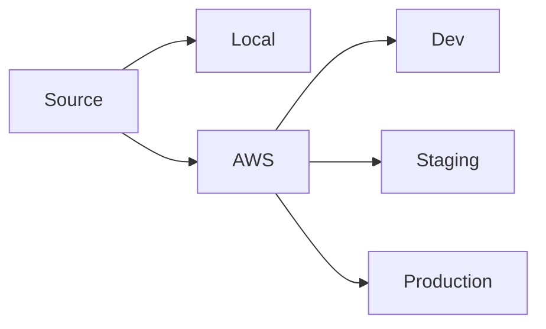

## Goals

Heroku enforces best practices.

Clear separation of application code and configuration.

Button-push deployments.

Central logs.

## Why not Heroku?

Zero deployment and running effort.

Small apps for about $50 a month is a good deal. Cheaper than hiring.

## Architecture

Local:

- Vagrant
- Virtualbox
- Windows

